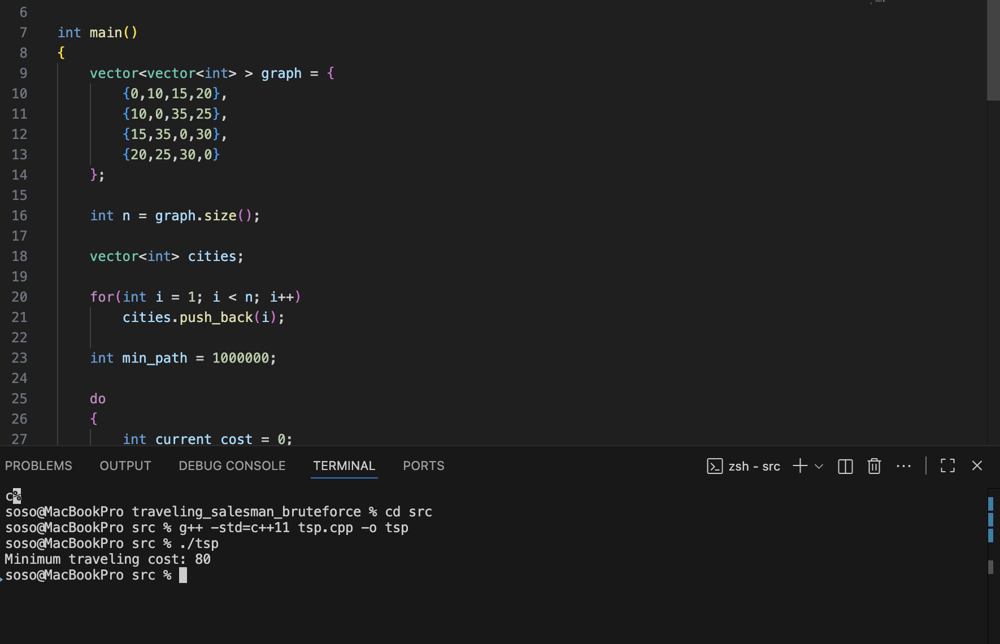

# Traveling Salesman Problem 

## Overview

In this project I implemented a simple version of the Traveling Salesman Problem.

The goal of the problem is to find the shortest possible route that visits every city exactly once and then returns to the starting city.

This problem is well known in computer science and is considered NP-hard, which means there is no known efficient algorithm that solves it for very large inputs.

## How the Algorithm Works

In this implementation a brute force approach is used.

The idea is:

1. Start at the first city.
2. Generate all possible permutations of the remaining cities.
3. Calculate the total travel cost for each possible route.
4. Keep track of the route with the smallest cost.

The shortest route found is the solution.

## Time Complexity

The time complexity of the brute force approach is O(n!).

Where n is the number of cities.

This happens because the algorithm checks every possible order of visiting the cities.

Because of this factorial growth, the problem becomes extremely slow for larger numbers of cities.

## Implementation

The algorithm is implemented in C++.

Source file:

src/tsp.cpp

The program uses a small example graph representing distances between cities and calculates the minimum travel cost.

## What I Learned

While working on this problem I learned more about:

- how brute force algorithms work
- why some problems are classified as NP-hard
- how quickly factorial time complexity grows
- why optimization problems like TSP are difficult to solve for large inputs

# Program Output

Below is a screenshot of the program running in VS Code.

